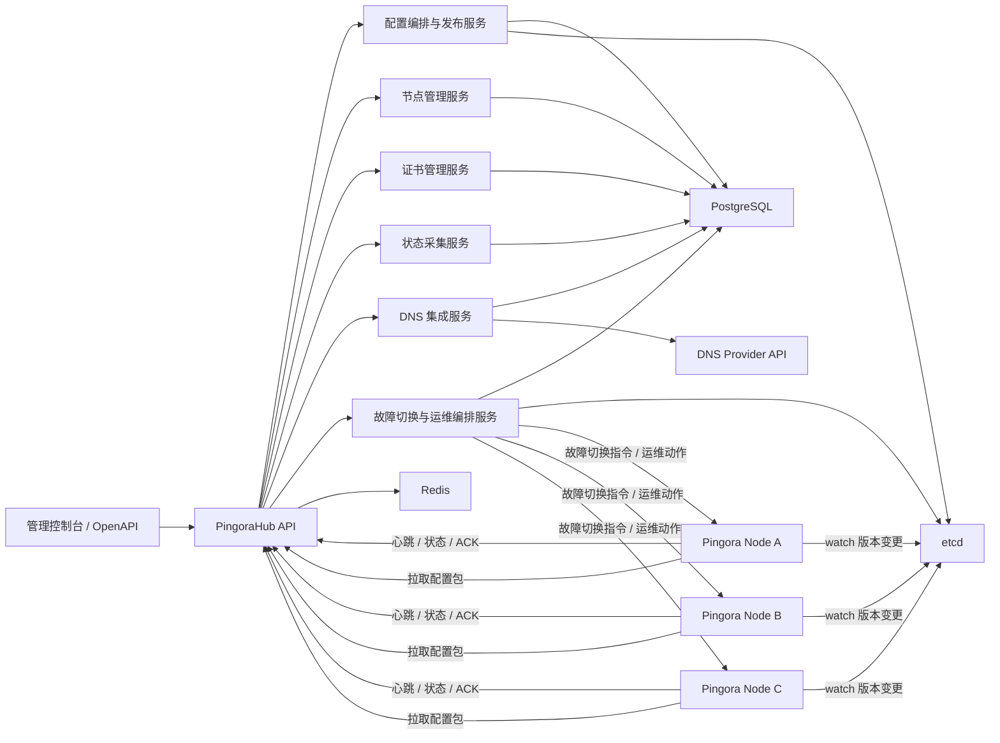
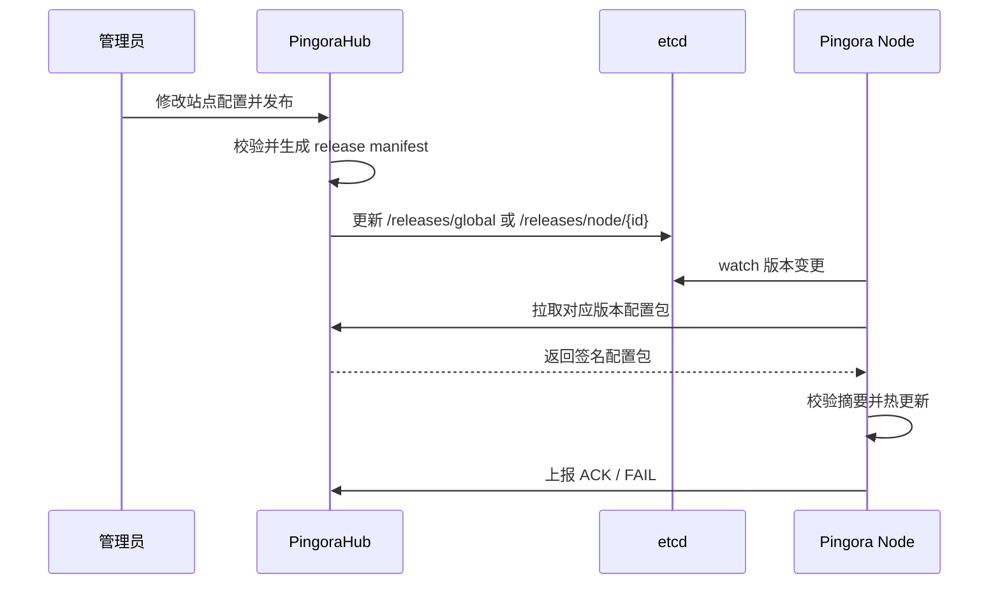

# PingoraHub 总体方案

## 1. 项目定位

PingoraHub 是一个基于 `Rust + PostgreSQL + Redis + etcd` 的集中式 Pingora 节点管理平台，目标是统一管理分布式接入节点，实现节点注册、认证、心跳、配置下发、证书管理、运行状态上报、DNS 接入和节点故障切换闭环。

平台整体分为两层：

- 控制面：负责站点配置管理、节点管理、证书管理、发布编排、审计和可观测
- 数据面：部署在各地的 Pingora 节点，负责拉取配置、加载证书、接入流量并上报运行状态

## 2. 建设目标

### 2.1 核心目标

- 统一管理分布式 Pingora 节点生命周期
- 统一管理站点、路由、证书和节点绑定关系
- 统一接入 DNS 服务商，支持 DNS 变更和基于 DNS 验证的 SSL 申请
- 让节点能够自动感知配置变更并安全热更新
- 具备节点故障检测、备用节点切换和受控运维动作执行能力
- 具备配置版本化、灰度发布、回滚和审计能力
- 为节点运行状态、健康状态和配置下发状态提供可观测能力

### 2.2 非目标

- 不在第一阶段实现完整 WAF、全链路计费、复杂多租户权限模型
- 不在第一阶段实现跨区域多活控制面，只预留扩展能力

## 3. 总体架构



## 4. 核心组件设计

### 4.1 PingoraHub API

建议采用 Rust `axum` 实现统一 API 网关与后台服务入口，职责包括：

- 管理端 API：站点、节点、证书、绑定关系、发布任务、审计查询
- 节点端 API：注册、认证、心跳、配置拉取、状态上报、发布确认
- 统一鉴权、输入校验、审计日志、限流和错误码标准化

### 4.2 节点管理服务

负责节点全生命周期管理：

- 节点注册与初始引导
- 节点身份认证与令牌轮换
- 心跳接收、状态更新、离线判定
- 节点标签管理，例如地域、机房、运营商、能力池
- 节点健康分数计算与调度可用性判断

### 4.3 配置编排与发布服务

负责把控制台配置转化为节点可消费的版本化配置：

- 站点配置校验与标准化
- 将站点、证书、上游、监听配置编译成 Pingora 可用配置快照
- 生成版本号、摘要和签名
- 维护全量发布与按节点差异化发布
- 支持灰度发布、回滚和失败重试

### 4.4 证书管理服务

负责证书全生命周期：

- 统一存储证书公钥、私钥、链和元数据
- 私钥加密存储
- 证书版本化与站点关联
- 到期预警和更新发布
- 节点按需拉取证书材料，避免无关节点持有敏感证书

### 4.5 状态采集服务

负责接收节点状态与运行指标：

- 节点基础状态：在线、离线、版本、最近心跳
- 配置状态：当前版本、应用时间、应用结果
- 运行状态：连接数、QPS、错误率、证书加载状态、后端健康状态
- 事件状态：热更新成功、失败、回滚、配置校验失败

### 4.6 DNS 集成服务

负责接入外部 DNS 服务商并统一管理域名解析与证书验证：

- 对接 Cloudflare、阿里云 DNS、Route53、DNSPod 等 DNS Provider
- 统一管理 DNS 账号、Zone、Record 和变更记录
- 为证书服务提供 ACME `DNS-01` 验证能力
- 提供站点切换、A/AAAA/CNAME/TXT 记录修改能力
- 支持 DNS 变更预览、审计和回滚

### 4.7 故障切换与运维编排服务

负责节点异常检测、备用节点切换和受控运维操作：

- 根据心跳、发布状态和健康检查识别异常节点
- 按站点或节点组定义主备关系与切换策略
- 当主节点故障时，将配置自动发布到备用节点
- 支持执行预定义运维动作，例如 VIP 绑定、路由切换、服务重载
- 记录切换原因、执行结果和回滚状态

## 5. 技术栈分工建议

### PostgreSQL

作为业务真源，存储需要持久化和审计的数据：

- 节点信息
- 站点信息
- 绑定关系
- 证书及版本
- DNS 账号、域名 Zone、记录与变更审计
- 配置发布记录
- 故障切换策略、运维动作模板与执行历史
- 状态汇总
- 操作审计日志

### Redis

作为高频访问和短期状态缓存：

- 节点注册挑战码、一次性引导令牌
- 节点会话令牌与刷新令牌
- 心跳最近状态缓存
- API 限流计数
- 发布任务短期队列或重试队列
- 故障切换去重锁与短期编排状态

### etcd

作为配置变更通知与发布索引中心：

- 发布版本指针
- 节点订阅 key
- 灰度发布目标集
- 主备切换后的目标节点版本指针
- 临时租约型在线标记

建议不要把完整证书私钥和大体积配置长期直接放在 etcd 中，etcd 更适合做“版本通知”和“小体积元信息”，正式配置包由节点通过 Hub API 拉取。

## 6. 数据模型设计

以下为第一阶段建议的核心表。

### 6.1 节点相关

`nodes`

- `id`
- `node_code`
- `name`
- `region`
- `idc`
- `labels`
- `public_ip`
- `private_ip`
- `status`
- `pingora_version`
- `agent_version`
- `last_seen_at`
- `created_at`
- `updated_at`

`node_credentials`

- `id`
- `node_id`
- `bootstrap_token_hash`
- `client_id`
- `client_secret_hash`
- `mtls_cert_fingerprint`
- `expires_at`
- `rotated_at`

`node_heartbeats`

- `id`
- `node_id`
- `cpu_usage`
- `mem_usage`
- `disk_usage`
- `load_status`
- `active_config_version`
- `reported_at`

### 6.2 站点与配置相关

`sites`

- `id`
- `site_code`
- `name`
- `domain`
- `listen_port`
- `protocol`
- `tls_enabled`
- `status`
- `created_at`
- `updated_at`

`site_configs`

- `id`
- `site_id`
- `version`
- `config_json`
- `config_hash`
- `created_by`
- `created_at`

`site_node_bindings`

- `id`
- `site_id`
- `node_id`
- `status`
- `bind_mode`
- `created_at`
- `updated_at`

### 6.3 证书相关

`certificates`

- `id`
- `cert_code`
- `common_name`
- `sans`
- `issuer`
- `not_before`
- `not_after`
- `fingerprint_sha256`
- `status`
- `created_at`
- `updated_at`

`certificate_versions`

- `id`
- `certificate_id`
- `version`
- `cert_pem`
- `key_pem_encrypted`
- `chain_pem`
- `kms_key_id`
- `created_at`

`site_cert_bindings`

- `id`
- `site_id`
- `certificate_id`
- `version`
- `is_default`
- `created_at`

### 6.4 发布与审计相关

`config_releases`

- `id`
- `release_code`
- `scope_type`
- `scope_id`
- `release_version`
- `manifest_json`
- `manifest_hash`
- `status`
- `published_at`
- `created_by`

`node_release_status`

- `id`
- `release_id`
- `node_id`
- `target_version`
- `current_version`
- `apply_status`
- `apply_message`
- `acked_at`
- `updated_at`

`audit_logs`

- `id`
- `operator_id`
- `action`
- `resource_type`
- `resource_id`
- `before_data`
- `after_data`
- `created_at`

### 6.5 DNS 相关

`dns_providers`

- `id`
- `name`
- `provider_type`
- `api_endpoint`
- `credential_encrypted`
- `status`
- `created_at`
- `updated_at`

`dns_zones`

- `id`
- `provider_id`
- `zone_name`
- `external_zone_id`
- `status`
- `created_at`
- `updated_at`

`dns_records`

- `id`
- `zone_id`
- `record_type`
- `host`
- `value`
- `ttl`
- `routing_policy`
- `status`
- `last_synced_at`
- `created_at`
- `updated_at`

`dns_change_logs`

- `id`
- `zone_id`
- `record_id`
- `change_type`
- `before_data`
- `after_data`
- `change_status`
- `operator_id`
- `created_at`

`certificate_orders`

- `id`
- `site_id`
- `certificate_id`
- `order_type`
- `acme_provider`
- `challenge_type`
- `order_status`
- `error_message`
- `created_at`
- `updated_at`

### 6.6 故障切换与运维编排相关

`failover_policies`

- `id`
- `scope_type`
- `scope_id`
- `primary_node_id`
- `standby_node_id`
- `trigger_mode`
- `failure_threshold`
- `recover_threshold`
- `precheck_policy`
- `status`
- `created_at`
- `updated_at`

`failover_events`

- `id`
- `policy_id`
- `site_id`
- `source_node_id`
- `target_node_id`
- `trigger_reason`
- `event_status`
- `started_at`
- `finished_at`

`operation_templates`

- `id`
- `name`
- `operation_type`
- `command_template`
- `allowed_params`
- `timeout_seconds`
- `run_as_user`
- `approval_required`
- `created_at`
- `updated_at`

`node_operations`

- `id`
- `node_id`
- `template_id`
- `event_id`
- `input_params`
- `exec_status`
- `stdout_log`
- `stderr_log`
- `started_at`
- `finished_at`

## 7. 核心流程设计

### 7.1 节点注册与认证

建议采用“双阶段注册”：

1. 运维在控制台创建节点，引导平台生成一次性 `bootstrap token`
2. 节点首次启动时携带 `node_code + bootstrap token` 调用注册接口
3. Hub 校验通过后，为节点签发长期身份凭据，例如 `client_id/client_secret` 或 mTLS 证书
4. 节点后续使用长期凭据进行心跳、配置拉取和状态上报

这样可以避免在镜像中硬编码长期密钥，也便于吊销和轮换。

### 7.2 节点心跳与离线判定

建议心跳周期为 `10s ~ 30s`，包含：

- 节点基础信息
- 当前配置版本
- 运行资源状态
- 当前加载站点数量
- 最近错误摘要

控制面逻辑建议：

- `2` 个心跳周期未收到，标记为 `suspect`
- `3` 到 `5` 个周期未收到，标记为 `offline`
- 离线节点不再作为新发布目标，但保留现有配置

### 7.3 站点创建与节点绑定

1. 管理员创建站点
2. 配置域名、监听端口、上游、TLS、回源规则等
3. 绑定目标节点或节点标签组
4. 配置编排服务生成新的站点配置版本
5. 生成发布记录并将版本指针写入 etcd

### 7.4 节点自动拉取与热更新



建议采用“watch + pull”模式，而不是“Hub 主动推送完整配置”，原因如下：

- 节点侧实现简单，断线重连后容易补偿
- 配置包传输链路清晰，便于鉴权和重试
- 便于做幂等处理、版本对比和回滚

### 7.5 证书下发流程

1. 证书导入后加密存储在 PostgreSQL
2. 证书绑定到站点时生成新的站点配置版本
3. 节点监听到发布版本变化后拉取新的配置包
4. 配置包中只包含该节点实际需要的证书材料
5. 节点在本地安全落盘或内存加载，并触发 TLS 热更新

### 7.6 状态上报流程

节点定期上报：

- 当前生效版本
- 配置应用结果
- 连接数、请求量、错误数
- 上游健康状态摘要
- 证书加载异常

Hub 将原始明细写入时序或明细表，将最新聚合状态写入节点和站点汇总表，供控制台快速查询。

### 7.7 DNS 接入与 SSL 自动申请

建议控制台支持接入 DNS Provider，并通过 ACME `DNS-01` 方式申请证书：

1. 管理员在控制台接入 DNS 账号并绑定 Zone
2. 站点开启“自动申请证书”，选择对应域名和 DNS Zone
3. Hub 创建证书申请任务，并调用 DNS Provider 写入 `_acme-challenge` TXT 记录
4. ACME 校验通过后，Hub 获取证书并加密存储
5. 证书绑定站点，生成新的配置版本并发布到目标节点
6. 如站点切换或灾备需要，控制台可同步修改 A/AAAA/CNAME 记录

推荐实现为 Provider Adapter 模式，统一抽象：

- `create_record`
- `update_record`
- `delete_record`
- `list_zone`
- `present_dns01_challenge`
- `cleanup_dns01_challenge`

### 7.8 节点故障切换与备用节点接管

当平台发现节点 `down/offline` 时，可按预设策略将配置切换到备用节点：

1. 状态采集服务检测主节点持续心跳丢失或健康检查失败
2. 故障切换服务匹配站点绑定关系和 `failover_policy`
3. 将受影响站点重新编排到备用节点
4. 发布服务生成新的节点配置版本，并写入 etcd 指针
5. 备用节点拉取配置并完成热更新
6. 如需要网络接管，执行运维动作模板，例如 VIP 绑定
7. 备用节点完成接管后，Hub 记录切换事件并持续观测恢复状态

这里建议“配置切换”和“节点运维动作”分两步处理：

- 第一步先确保业务配置在备用节点生效
- 第二步再执行网络侧接管动作，例如 `ip addr add`、`arp announce`、`keepalived reload`

这样即使运维动作失败，也不会影响配置已在备用节点预热和加载。

## 8. 配置发布模型

### 8.1 版本策略

建议采用两级版本：

- 站点版本：某个站点配置发生变更时递增
- 发布版本：一次正式下发动作的全局版本或批次版本

节点侧至少保存：

- 当前生效版本
- 上一个稳定版本

这样在热更新失败时可以快速本地回滚。

### 8.2 发布粒度

建议支持三种发布范围：

- 全量发布：适用于底层模板变更
- 按站点发布：适用于单站点配置更新
- 按节点发布：适用于灰度发布或故障修复

对于主备场景，建议额外支持：

- 预热发布：提前把配置同步到备用节点，但不接管流量
- 故障切换发布：节点故障后将目标站点切换为备用节点主承载
- 恢复发布：主节点恢复后按策略决定是否回切

### 8.3 回滚策略

控制面保留最近若干版本配置快照，回滚时：

1. 将目标版本重新标记为最新版本
2. 写入 etcd 发布指针
3. 节点重新拉取并应用旧版本

## 9. 安全设计

### 9.1 身份认证

- 管理端使用 RBAC + JWT/OIDC
- 节点端使用 `bootstrap token` 完成首次注册
- 注册后使用 mTLS 或签名令牌进行双向认证

如果对安全要求较高，优先推荐节点侧使用 mTLS。

### 9.2 敏感数据保护

- 证书私钥必须加密存储
- 节点凭据仅存哈希或指纹
- 配置包建议带签名和摘要
- 审计日志记录关键操作，例如证书导入、站点发布、节点解绑

### 9.3 权限隔离

- 管理员权限与节点权限完全分离
- 节点只允许访问自身配置和状态上报接口
- 证书按站点和节点进行最小化分发

### 9.4 DNS 与远程命令安全

- DNS Provider 凭据必须加密存储，并限制到最小 Zone 权限
- DNS 变更必须记录变更前后内容和操作人
- 不建议直接提供“任意 shell 执行”
- 推荐采用“命令模板 + 参数白名单 + 超时控制 + 审批流 + 全量审计”模式
- 高风险动作例如 VIP 绑定、路由修改，建议要求双人审批或仅允许预定义模板

## 10. 高可用与可靠性设计

### 10.1 控制面高可用

- PingoraHub API 多实例部署
- PostgreSQL 主从或高可用集群
- Redis 哨兵或集群
- etcd 三节点奇数集群

### 10.2 节点容错

- 节点本地缓存最近稳定配置
- 控制面短时不可用时节点继续承载流量
- etcd watch 中断后支持自动重连与全量对账

### 10.3 幂等与补偿

- 所有节点 ACK 接口按 `node_id + release_id` 幂等
- 节点拉取配置接口支持按版本重复获取
- 发布任务失败支持重试与人工回滚

### 10.4 自动切换可靠性

- 节点故障判定建议结合心跳、主动探测和最近发布状态，避免误切
- 故障切换动作需具备去重锁，避免同一事件重复切换
- 备用节点建议提前预热常用站点配置和证书，缩短接管时间
- 回切建议默认人工确认，避免主节点抖动导致频繁切换

## 11. API 设计建议

### 11.1 管理端 API

- `POST /api/admin/nodes`
- `POST /api/admin/sites`
- `PUT /api/admin/sites/{id}`
- `POST /api/admin/sites/{id}/bindings`
- `DELETE /api/admin/sites/{id}/bindings/{node_id}`
- `POST /api/admin/certificates`
- `POST /api/admin/dns/providers`
- `POST /api/admin/dns/zones/sync`
- `POST /api/admin/dns/records`
- `POST /api/admin/certificates/orders`
- `POST /api/admin/releases`
- `POST /api/admin/releases/{id}/rollback`
- `POST /api/admin/failover/policies`
- `POST /api/admin/failover/trigger`
- `POST /api/admin/operations/templates`
- `POST /api/admin/nodes/{id}/operations`

### 11.2 节点端 API

- `POST /api/node/register`
- `POST /api/node/auth/refresh`
- `POST /api/node/heartbeat`
- `GET /api/node/config/releases/latest`
- `GET /api/node/config/package/{version}`
- `POST /api/node/releases/{id}/ack`
- `POST /api/node/status/report`
- `POST /api/node/operations/{id}/result`

## 12. 建议的代码结构

```text
pingorahub/
├── apps/
│   ├── hub-api/              # 管理端 + 节点端统一 API
│   ├── release-worker/       # 发布编排与重试任务
│   ├── status-worker/        # 状态聚合任务
│   ├── dns-worker/           # DNS 同步、ACME 证书申请与续期
│   └── failover-worker/      # 故障检测、切换编排、运维动作派发
├── crates/
│   ├── domain/               # 领域模型与业务规则
│   ├── application/          # 用例编排
│   ├── infrastructure/       # pg/redis/etcd 实现
│   ├── protocol/             # DTO、API 协议、鉴权模型
│   ├── config-compiler/      # 配置编译与签名
│   ├── dns-provider/         # DNS Provider Adapter 抽象与实现
│   └── ops-orchestrator/     # 运维动作模板与任务编排
├── migrations/
├── docs/
└── deploy/
```

如果节点侧也由本项目维护，可增加：

```text
├── apps/
│   └── node-agent/           # 节点守护进程，负责 watch/pull/reload/report/operation
```

## 13. 分阶段实施计划

### 阶段一：最小可用版本

目标是先打通“配置从控制面到节点”的核心链路。

- 节点注册、认证、心跳
- 站点创建、编辑、绑定
- 简单证书导入与绑定
- DNS Provider 接入与手动 DNS 记录管理
- 配置版本生成
- etcd 版本通知
- 节点拉取配置并热更新
- 节点 ACK 与状态展示

### 阶段二：增强可用性

- 节点标签组与批量绑定
- 灰度发布与回滚
- 基于 DNS `DNS-01` 的证书自动申请与续期
- 节点故障自动切换到备用节点
- VIP 绑定等模板化运维动作
- 证书轮换与到期预警
- 更完整的审计日志
- 节点运行指标聚合看板

### 阶段三：平台化能力

- 多租户与细粒度 RBAC
- OpenAPI / Terraform Provider
- 多区域控制面容灾
- 与外部监控告警系统集成

## 14. 风险点与应对建议

### 风险 1：配置热更新失败影响线上流量

建议：

- 节点先本地校验新配置
- 使用双版本缓存
- 热更新失败自动回滚到上一个稳定版本

### 风险 2：证书私钥泄露

建议：

- 私钥加密存储
- 节点最小化分发
- 关键接口启用 mTLS
- 全量审计证书访问与发布记录

### 风险 3：etcd 存储体积膨胀或 watch 压力过大

建议：

- etcd 仅保存发布索引和轻量元信息
- 大配置包通过 API 获取
- watch key 设计按节点或标签分层，避免全量广播

### 风险 4：节点离线后恢复产生版本漂移

建议：

- 节点重连后先查询最新发布版本
- 对比本地版本后执行补拉
- 控制面保留足够历史版本供补偿

### 风险 5：DNS 凭据泄露或误修改解析

建议：

- 采用最小权限 API Token
- 敏感凭据加密存储
- 关键域名操作增加审批和审计
- 支持回滚最近一次 DNS 变更

### 风险 6：远程命令执行被滥用

建议：

- 默认只允许执行模板化命令，不开放任意 shell
- 模板参数做白名单校验
- 限制执行用户、超时和可访问资源
- 对高危动作启用审批和告警

## 15. 推荐落地路线

如果以“尽快上线一个能用版本”为目标，推荐按以下优先级推进：

1. 完成节点注册、认证、心跳和离线判定
2. 完成站点配置管理与节点绑定
3. 完成配置编译、版本化和节点拉取热更新
4. 完成 DNS 接入、证书自动签发和证书版本下发
5. 完成节点状态监控、备用节点切换和运维动作模板
6. 完成状态上报、审计和灰度发布

## 16. 结论

这个方案的关键思想是：

- PostgreSQL 负责业务真源和审计
- Redis 负责缓存、会话和高频状态
- etcd 负责发布通知和版本感知
- 节点采用 watch + pull 模式拉取配置
- DNS 通过 Provider Adapter 接入，支持证书申请和解析变更
- 节点切换通过“故障检测 + 备用节点发布 + 模板化运维动作”完成
- 配置与证书均采用版本化、可回滚、可审计的方式管理

这样可以在保证集中管理能力的同时，兼顾节点侧的稳定性、安全性和可扩展性。
